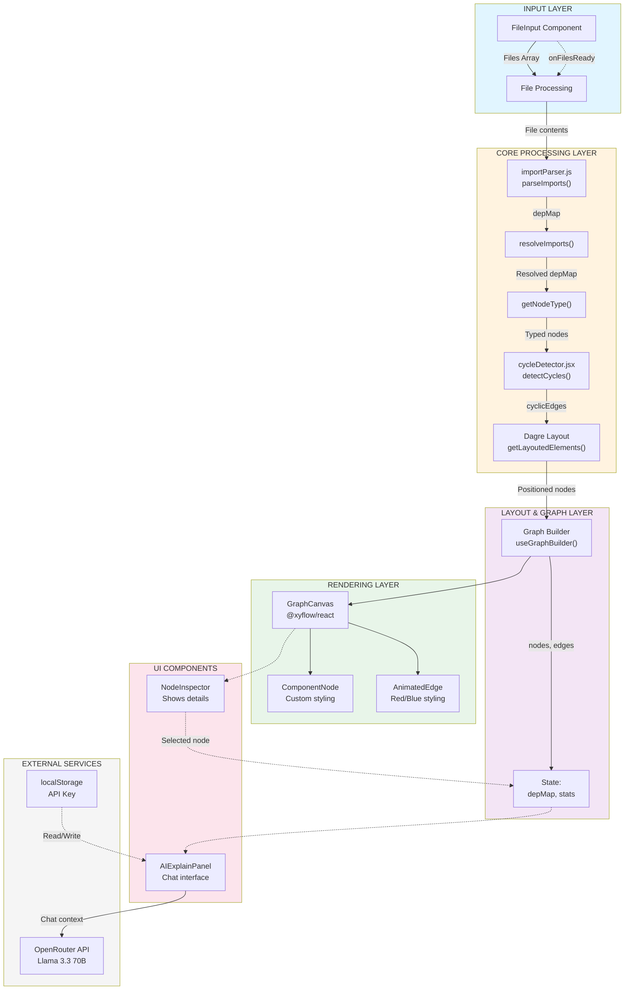

# ReactViz - Architecture Diagrams & Visual Reference

## 📐 SYSTEM ARCHITECTURE



---

## 🔄 DATA TRANSFORMATION PIPELINE

```
┌─────────────────────────────────────────────────────────────────┐
│                     USER UPLOADS FILES                           │
│                   (Array of {name, content})                     │
└─────────────────────────────────────────────────────────────────┘
                              ↓
┌─────────────────────────────────────────────────────────────────┐
│           PARSEIMPORTS() - EXTRACT IMPORTS                       │
│                    ↓                                              │
│  Regex matches: import X from './Y'                              │
│                 const X = require('./Y')                         │
│                                                                   │
│  Output: {                                                       │
│    "App.jsx": ["./components/Navbar", "../hooks/useAuth"],      │
│    "Navbar.jsx": ["./Button"],                                  │
│  }                                                               │
└─────────────────────────────────────────────────────────────────┘
                              ↓
┌─────────────────────────────────────────────────────────────────┐
│        RESOLVEIMPORTS() - NORMALIZE PATHS                        │
│                    ↓                                              │
│  Convert relative paths to absolute filenames:                  │
│  "./components/Navbar" → "src/components/Navbar.jsx"            │
│                                                                   │
│  Output: {                                                       │
│    "src/App.jsx": ["src/components/Navbar.jsx", "src/hooks/useAuth.js"],
│    "src/components/Navbar.jsx": ["src/components/Button.jsx"],  │
│  }                                                               │
└─────────────────────────────────────────────────────────────────┘
                              ↓
┌─────────────────────────────────────────────────────────────────┐
│       GETNOTETYPE() - CLASSIFY FILES                             │
│                    ↓                                              │
│  Analyze filename & path:                                        │
│  • useAuth.js → "hook"                                           │
│  • Button.jsx → "component"                                      │
│  • helpers.js → "util"                                           │
│  • index.js → "other"                                            │
│                                                                   │
│  Enhance nodes with type metadata                                │
└─────────────────────────────────────────────────────────────────┘
                              ↓
┌─────────────────────────────────────────────────────────────────┐
│      DETECTCYCLES() - FIND CIRCULAR DEPENDENCIES                 │
│                    ↓                                              │
│  DFS Algorithm:                                                  │
│  1. Visit each node                                              │
│  2. Track path & stack                                           │
│  3. If node in stack → CYCLE FOUND                               │
│  4. Mark all edges in cycle                                      │
│                                                                   │
│  Output: [                                                       │
│    ["App.jsx", "Modal.jsx"],  ← marks these edges as cyclic     │
│    ["Modal.jsx", "Button.jsx"],                                 │
│    ["Button.jsx", "App.jsx"]                                    │
│  ]                                                               │
└─────────────────────────────────────────────────────────────────┘
                              ↓
┌─────────────────────────────────────────────────────────────────┐
│       BUILDNODES() & BUILDEDGES() - CREATE GRAPH DATA            │
│                    ↓                                              │
│  nodes[] = [                                                     │
│    {                                                             │
│      id: "src/App.jsx",                                          │
│      data: {label, nodeType, imports, importedBy},             │
│      style: {...based on nodeType...}                           │
│    }, ...                                                        │
│  ]                                                               │
│                                                                   │
│  edges[] = [                                                     │
│    {                                                             │
│      id: "edge-1",                                               │
│      source: "src/App.jsx",                                      │
│      target: "src/components/Navbar.jsx",                       │
│      style: {stroke: cyclic ? '#ef4444' : '#3b82f6'}            │
│    }, ...                                                        │
│  ]                                                               │
└─────────────────────────────────────────────────────────────────┘
                              ↓
┌─────────────────────────────────────────────────────────────────┐
│   GETLAYOUTEDELEMENTS() - POSITION NODES WITH DAGRE              │
│                    ↓                                              │
│  Dagre Algorithm:                                                │
│  • Creates hierarchical layout                                   │
│  • Minimizes edge crossings                                      │
│  • Respects cyclic edges                                         │
│                                                                   │
│  Enhanced nodes[] with position: {x, y}                         │
│  {sourcePosition, targetPosition} for edge anchoring            │
└─────────────────────────────────────────────────────────────────┘
                              ↓
┌─────────────────────────────────────────────────────────────────┐
│    REACT FLOW RENDERING (@xyflow/react)                         │
│                    ↓                                              │
│  For each node:                                                  │
│    • Render ComponentNode (custom styled node)                  │
│                                                                   │
│  For each edge:                                                  │
│    • Render AnimatedEdge (red if cyclic, blue if normal)        │
│                                                                   │
│  Add controls: Pan, Zoom, MiniMap                                │
└─────────────────────────────────────────────────────────────────┘
                              ↓
              ┌───────────────┴───────────────┐
              ↓                               ↓
    ┌──────────────────────┐    ┌──────────────────────┐
    │  NODE INSPECTOR      │    │  AI EXPLAIN PANEL    │
    │  (Click to inspect)  │    │  (Ask about code)    │
    │                      │    │                      │
    │ Shows:               │    │ Sends context →      │
    │ • Imports            │    │ OpenRouter API       │
    │ • ImportedBy         │    │ ← Gets explanation   │
    │ • Node type          │    │                      │
    └──────────────────────┘    └──────────────────────┘
```

---

## 🗂️ COMPONENT DEPENDENCY TREE

```
App.jsx (ROOT)
│
├─── FileInput/index.jsx
│    └─ (imports React only)
│
├─── GraphCanvas/index.jsx
│    ├─ @xyflow/react
│    ├─ dagre
│    ├─ ComponentNode.jsx
│    │  └─ @xyflow/react/Handle
│    │
│    └─ AnimatedEdge.jsx
│       └─ @xyflow/react (BaseEdge, EdgeLabelRenderer, getBezierPath)
│
├─── NodeInspector/index.jsx
│    └─ (imports React only)
│
├─── AIExplainPanel/index.jsx
│    └─ useAIExplain hook
│
├─── useGraphBuilder.js (HOOK)
│    ├─ dagre
│    ├─ importParser.js
│    │  └─ (no dependencies, pure utility)
│    │
│    └─ cycleDetector.jsx
│       └─ (no dependencies, pure utility)
│
└─── useAIExplain.js (HOOK)
     └─ (only React, no internal dependencies)

EXTERNAL DEPENDENCIES:
├─ react ^19.2.4
├─ react-dom ^19.2.4
├─ @xyflow/react ^12.10.1
├─ dagre ^0.8.5
└─ tailwindcss ^4.2.1
```

---

## 📊 STATE MANAGEMENT FLOW

```
┌──────────────────────────────────────────────┐
│         APP.JSX - MAIN STATE HOLDER          │
└──────────────────────────────────────────────┘
│
├─ graphReady: boolean
│  ├─ false  → render FileInput
│  └─ true   → render GraphCanvas + panels
│
├─ selectedNode: object | null
│  ├─ onClick in GraphCanvas → setSelectedNode()
│  └─ used by NodeInspector & AIExplainPanel
│
├─ showInspector: boolean
│  ├─ toggle button
│  └─ controls NodeInspector visibility
│
├─ apiKey: string
│  ├─ localStorage.getItem('reactviz_api_key')
│  ├─ user can change in settings
│  └─ required for AI chat
│
├─ search: string
│  ├─ filter graph nodes
│  └─ highlight search results
│
└─ messages: array
   ├─ AI chat history
   └─ from useAIExplain hook

┌──────────────────────────────────────────────┐
│      USEGRAPHBUILDER - GRAPH STATE            │
└──────────────────────────────────────────────┘
│
├─ nodes: array (@xyflow nodes)
│  ├─ id, data, position, style
│  └─ updated on file upload
│
├─ edges: array (@xyflow edges)
│  ├─ source, target, style
│  └─ red if cyclic, blue if normal
│
├─ depMap: object
│  ├─ {filename: [imports], ...}
│  └─ passed to NodeInspector & AIExplainPanel
│
├─ stats: object
│  ├─ totalFiles, totalComponents, totalHooks, cyclesFound
│  └─ passed to NodeInspector & AIExplainPanel
│
└─ buildGraph: function
   └─ called by FileInput onFilesReady()

┌──────────────────────────────────────────────┐
│      USEAIEXPLAIN - CHAT STATE                │
└──────────────────────────────────────────────┘
│
├─ messages: array
│  ├─ {role: 'user'|'assistant', content, id}
│  └─ displayed in AIExplainPanel
│
├─ loading: boolean
│  ├─ true while API request pending
│  └─ shows spinner in UI
│
├─ error: string
│  ├─ error message or empty
│  └─ displayed in AIExplainPanel
│
└─ sendMessage: function
   ├─ builds context from nodeData, depMap, stats
   ├─ calls OpenRouter API
   └─ updates messages array
```

---

## 🔌 API INTEGRATION DIAGRAM

```
┌─────────────────────────────────────┐
│   AIExplainPanel Component          │
│   (User asks question)              │
└────────────────┬────────────────────┘
                 │
                 ↓
        ┌────────────────────┐
        │  useAIExplain Hook │
        │  sendMessage()     │
        └────────┬───────────┘
                 │
         ┌───────┴────────┐
         ↓                ↓
    Build context   Validate API key
    from:
    - selectedNode  └─────┬────────┐
    - depMap              │        │
    - stats           Valid?     Invalid?
                      Yes         No
                      │           │
                      ↓           ↓
            ┌──────────────────┐  Error:
            │  API Request     │  "API key required"
            │  to OpenRouter   │
            └────────┬─────────┘
                     │
          ┌──────────┴──────────┐
          ↓                     ↓
      Success            Network Error
      ↓                  ↓
    Parse             Show error
    response           in UI
    ↓
    Add to
    messages[]
    ↓
    Update UI

REQUEST STRUCTURE:
POST https://openrouter.ai/api/v1/chat/completions
Headers:
  Authorization: Bearer ${apiKey}
  Content-Type: application/json

Body:
{
  model: "meta-llama/llama-3.3-70b-instruct:free",
  messages: [
    {role: "system", content: SYSTEM_PROMPT},
    {role: "user", content: "context:\n..."},
    {role: "user", content: "question from user"}
  ]
}

SYSTEM_PROMPT explains how to act as React mentor
CONTEXT includes:
- Currently looking at: [filename]
- Type: component/hook/util/other
- Imports: [list]
- Used by: [list]
- Full project structure summary
- Stats: files, components, hooks, circular deps
```

---

## 🎨 NODE STYLING BY TYPE

```
┌─────────────────────────────────────────────┐
│         COMPONENTNODE.JSX STYLING           │
└─────────────────────────────────────────────┘

IF nodeType === 'component':
  ├─ Background: #3b82f6 (blue)
  ├─ Border: 2px solid #1e40af
  ├─ Icon: ⚛️ (React icon)
  └─ Text: White, bold

IF nodeType === 'hook':
  ├─ Background: #f59e0b (amber)
  ├─ Border: 2px solid #b45309
  ├─ Icon: 🪝 (Hook icon)
  └─ Text: Dark, bold

IF nodeType === 'util':
  ├─ Background: #8b5cf6 (purple)
  ├─ Border: 2px solid #6d28d9
  ├─ Icon: 🔧 (Wrench icon)
  └─ Text: White, normal

IF nodeType === 'other':
  ├─ Background: #6b7280 (gray)
  ├─ Border: 1px dashed #4b5563
  ├─ Icon: 📄 (File icon)
  └─ Text: White, normal

SIZE:
├─ Width: 200px (fixed)
├─ Height: 70px (fixed)
└─ Responsive font size for long names

HOVER STATE:
├─ Opacity: 0.8
├─ Scale: 1.05
└─ Shadow: Glow effect
```

---

## 🔴 CYCLIC EDGE VISUALIZATION

```
NORMAL EDGE (Blue):
┌─────────────────────────────────────────┐
│ A imports B                             │
│ A.jsx ──────→ B.jsx                    │
│ Color: #3b82f6 (blue)                   │
│ Style: Solid line                       │
│ Animation: None                         │
└─────────────────────────────────────────┘

CYCLIC EDGE (Red):
┌─────────────────────────────────────────┐
│ A → B → C → A (cycle)                   │
│                                         │
│ A.jsx ──────→ B.jsx                    │
│  ↓                                      │
│ (all edges red)                         │
│  ↓                                      │
│ C.jsx ──────→ A.jsx                    │
│                                         │
│ Color: #ef4444 (red)                    │
│ Style: Solid line                       │
│ Animation: Animated dash                │
│ Stroke width: 2.5px (thicker)          │
└─────────────────────────────────────────┘

DETECTION ALGORITHM:
  While traversing from A:
    A → B (mark as visited)
      B → C (mark as visited)
        C → A (A is in stack = CYCLE)
          Mark edges: A→B, B→C, C→A as cyclic

RENDERING:
  In GraphCanvas, edges with [source, target] in cyclicEdges[]
  get stroke: '#ef4444' and strokeDasharray for animation
```

---

## 📈 FILE SIZE & COMPLEXITY REFERENCE

```
FILE ANALYSIS:

src/App.jsx
├─ Lines: ~150
├─ Complexity: Medium (state orchestration)
├─ Dependencies: 6 (FileInput, GraphCanvas, NodeInspector, 2 hooks, styles)
└─ Difficulty to modify: Medium

src/hooks/useGraphBuilder.js
├─ Lines: ~200
├─ Complexity: High (algorithm-heavy)
├─ Dependencies: 3 (dagre, importParser, cycleDetector)
└─ Difficulty to modify: High (touches core logic)

src/utils/importParser.js
├─ Lines: ~80
├─ Complexity: Medium (regex patterns)
├─ Dependencies: 0 (pure utility)
└─ Difficulty to modify: Medium (regex needs testing)

src/utils/cycleDetector.jsx
├─ Lines: ~50
├─ Complexity: High (DFS algorithm)
├─ Dependencies: 0 (pure utility)
└─ Difficulty to modify: High (algorithm-critical)

src/components/GraphCanvas/index.jsx
├─ Lines: ~100
├─ Complexity: Medium (@xyflow API)
├─ Dependencies: 5 (@xyflow modules, dagre, node/edge types)
└─ Difficulty to modify: Medium

src/hooks/useAIExplain.js
├─ Lines: ~100
├─ Complexity: Medium (API integration)
├─ Dependencies: 1 (fetch/axios for API)
└─ Difficulty to modify: Easy (mostly string building)

Total Project Size: ~750 lines (excluding node_modules)
Estimated Learning Time: 2-4 hours for new developer
Estimated Feature Addition: 1-2 days per feature
```

---

## 🚀 OPTIMIZATION OPPORTUNITIES

```
CURRENT BOTTLENECKS:
┌────────────────────────────────────────┐
│ 1. File Parsing (parseImports)         │
│    • Time: O(n * m) where n=files,    │
│            m=avg lines per file       │
│    • For 1000 files: ~2-5 seconds     │
└────────────────────────────────────────┘

┌────────────────────────────────────────┐
│ 2. Cycle Detection (detectCycles)      │
│    • Time: O(V + E) DFS               │
│    • For 1000 files: ~1 second        │
└────────────────────────────────────────┘

┌────────────────────────────────────────┐
│ 3. Dagre Layout                        │
│    • Time: O(V²) worst case           │
│    • For 1000 files: ~3-5 seconds     │
└────────────────────────────────────────┘

┌────────────────────────────────────────┐
│ 4. Graph Rendering                     │
│    • Time: O(V + E)                   │
│    • Smooth pan/zoom up to 500 nodes  │
│    • Stutters beyond 1000 nodes       │
└────────────────────────────────────────┘

SOLUTIONS:
├─ Web Workers for parsing
├─ Chunked rendering with virtualization
├─ Memoization of depMap & stats
├─ Alternative layout algorithms (Elk, Dagre-D3)
└─ Canvas rendering instead of SVG
```

---

## 🧪 DEBUGGING STRATEGIES

```
PROBLEM: Cycles not detected
STEPS:
1. Add console.log in cycleDetector.js visited/inStack sets
2. Verify depMap has correct resolved paths
3. Check if DFS reaches the cycle node
4. Test with simple 2-node cycle first

PROBLEM: Graph layout looks weird
STEPS:
1. Try different rankdir: 'TB' vs 'LR'
2. Adjust ranksep, nodesep parameters
3. Check if cyclic edges break layout
4. Verify node positions aren't NaN

PROBLEM: Imports not detected
STEPS:
1. Log regex matches in parseImports()
2. Verify file content is string, not binary
3. Check for non-standard import syntax
4. Test regex on sample files

PROBLEM: AI responses slow
STEPS:
1. Check API response time (network tab)
2. Verify context isn't too large
3. Try different free model
4. Add timeout to prevent hanging
```

